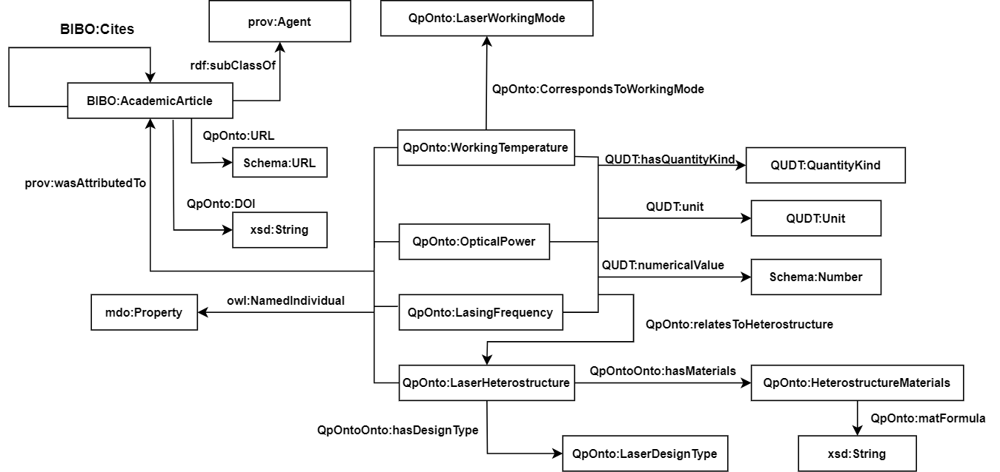

## Semantic Enrichment of QCL properties from Text
* In this work, we propopose a pipeline for an automatic generation of a knowledge graph (KG) for the QCL semiconductor laser properties from scientific literature based on a fine-tuned LLM.
* The approach entails automatic extraction of QCL prpoerties of interest form scientific literature based on a fine-tuned LLM  and population of the KG Schema with the extracted properties to generate the KG.
*  A notebook to show sample testing of the proposed llm on an abstract from a research paper with QCL properties is given [here](src/LLM/Evaluation/test.ipynb) 
## KG Schema

## Citation
* TBD
### License
This work is licensed under a [Creative Commons Attribution 4.0 International
License](http://creativecommons.org/licenses/by/4.0/).

## Acknowledgements
Funded by the French Embassy in Kenya (Scientific and Academic Cooperation Department) and the CNRS (under the framework “Dispositif de Soutien aux Collaborations avec l’Afrique sub-saharienne").

